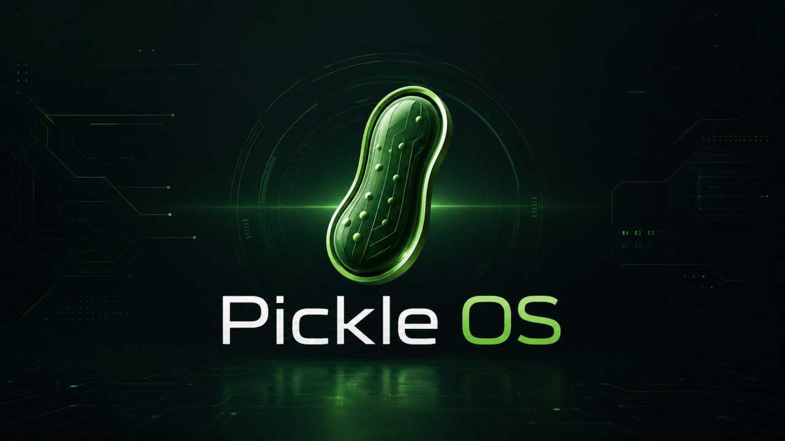

# 🥒 PickleOS

**An open source operating system without any privacy worries. No ads, no spyware, no telemetry.**

A from-scratch **microkernel OS written in Rust** for x86_64. Boots to a graphical desktop with window manager, networking, filesystem, IPC, and an interactive shell.



---

## What works today

| Subsystem | Status |
|-----------|--------|
| **Boot to graphical desktop** (BIOS/VESA) | ✅ |
| **Compositing window manager** — desktop, taskbar, draggable windows | ✅ |
| **Window server** — shared buffers, event queues, window registry | ✅ |
| **Preemptive round-robin scheduler** | ✅ |
| **Paging / per-task address spaces** | ✅ |
| **Ring-3 user processes** (ELF loader, fork/exec/wait/exit) | ✅ |
| **Pipes + signals** (kill/signal/sigreturn) | ✅ |
| **Synchronous IPC + capabilities** | ✅ |
| **NextFS on-disk filesystem** via AHCI/SATA | ✅ |
| **TCP/IP networking** (smoltcp + e1000) | ✅ |
| **In-kernel shell** with pipes & redirect | ✅ |
| **4 GUI apps** (launcher, file manager, text editor, taskbar) | ✅ |
| **46 syscalls** | ✅ |

**Sample boot:**
```
PICKLE OS: booting microkernel v0.1.0
[pci] 7 device(s) found
[ahci] SATA controller — 8086:2922
[e1000] link up, IP 10.0.2.15/24
[heartbeat] tick 5
[wm-selftest] => PASS
[net-demo] TCP echo on port 7
PICKLE OS shell — type 'help'
pickleos>
```

---

## Quick start

```bash
# Prerequisites
rustup component add rust-src llvm-tools-preview
cargo install bootloader_linker --version 0.1.7
sudo apt-get install qemu-system-x86

# Build & boot
make build      # compile kernel + userspace
make image      # produce bootable bios.img
make run        # headless: serial console
make run-display # graphical: QEMU window
```

---

## Project layout

```
pickleos/
├── kernel/src/        # 43 modules — scheduler, IPC, GUI, FS, drivers, net
├── userspace/         # 4 Rust GUI apps + C programs + libpickleos
├── docs/              # Architecture, roadmap, gap analysis
├── scripts/           # QEMU helpers, test scripts
└── Makefile           # build, test, run, debug targets
```

---

## Production roadmap

PickleOS is a real working kernel — it boots, runs a GUI, networks, and stores files. It's not production-ready (yet). The gap is measured in engineer-years.

**Phase 1 — Critical Stability (current):**  
✅ **✓** Fix NextFS concurrency race — interrupt-safe lock prevents deadlock when preempted during block I/O  
✅ **✓** Fix window Z-order bug — close handler preserves focus; background-window close no longer steals focus  
✅ **✓** Fix drag ceiling — windows can't be dragged below taskbar; new windows respect screen bounds  
✅ **✓** Kernel panic backtrace — frames printed via RBP chain on any panic  
✅ **✓** Lock ordering audit — PIPES vs FD_TABLES now consistent (FD_TABLES → PIPES, never reversed)  
4. Build test harness + CI  
5. 24h soak test  

See [`docs/PRODUCTION_ROADMAP.md`](docs/PRODUCTION_ROADMAP.md) for the full gap analysis.

---

**Why?** Because building an OS from scratch is one of the most satisfying things you can do with a computer. And everyone deserves an OS that respects their privacy.

**License:** MIT OR Apache-2.0
